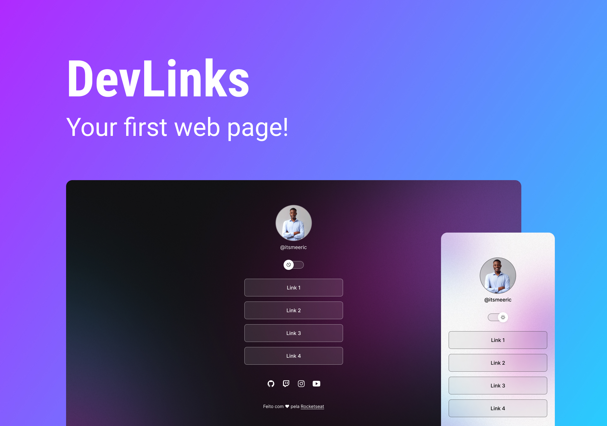

<h1 align="center"> Developer Links </h1>

Hosted by Rocketseat to improve students knowledge and created by <a href="https://github.com/itsmeEric">@itsmeEric</a>.

  <a href="#-tecnologias">Technologies</a>&nbsp;&nbsp;&nbsp;|&nbsp;&nbsp;&nbsp;
  <a href="#-projeto">Project</a>&nbsp;&nbsp;&nbsp;|&nbsp;&nbsp;&nbsp;
  <a href="#-layout">Layout</a>&nbsp;&nbsp;&nbsp;|&nbsp;&nbsp;&nbsp;
  <a href="#memo-licença">License</a>

  

 

  

## 🚀 Technologies

This project was built using the following technologies:

- HTML & CSS
- JavaScript
- Git & Github
- Figma

## 💻 Project

This project is an aggregated links for a developer to share his social medias links.

## 🔖 Layout

You can visualize the project here [THIS LINK](https://www.figma.com/file/J1Z33MISC22YZB8wfxiIns/NLW-Copa-Explorer/duplicate). You must have a figma account [Figma](https://figma.com) to have access to it.

## :memo: License

This project is lincensed by MIT.

---

Created with ♥ by Eric :wave: [Join the Rocketseat community!](https://discord.gg/rocketseat)
